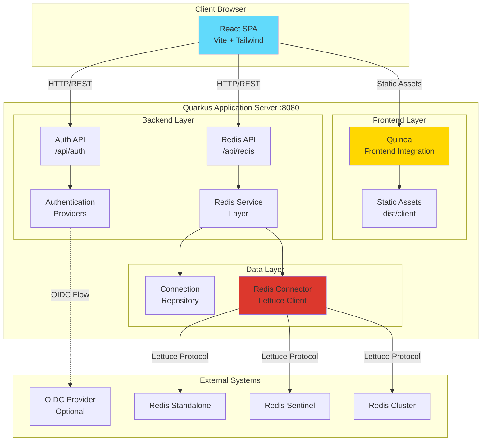
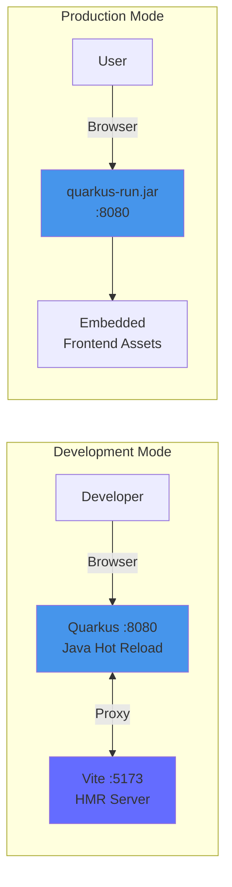
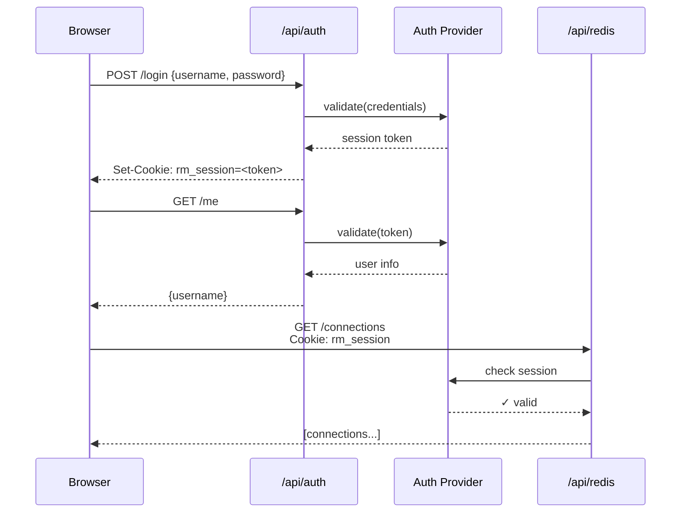
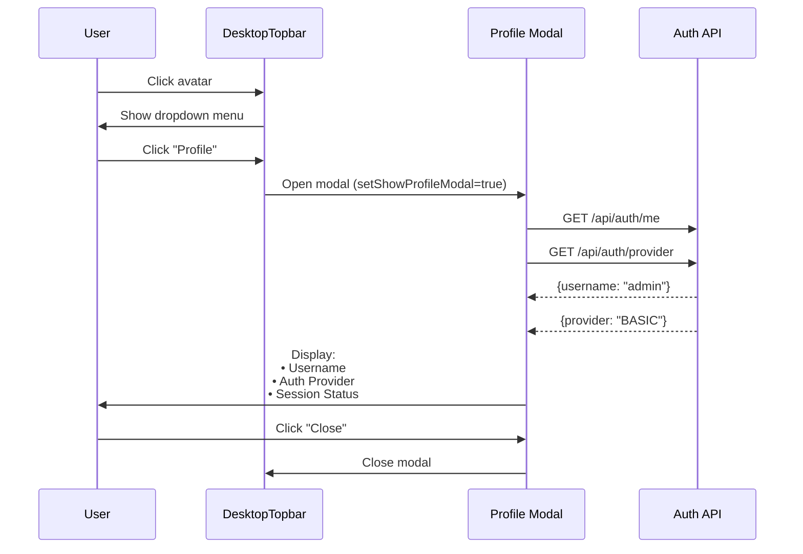
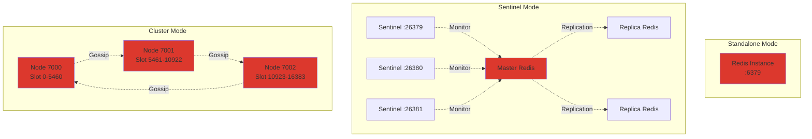
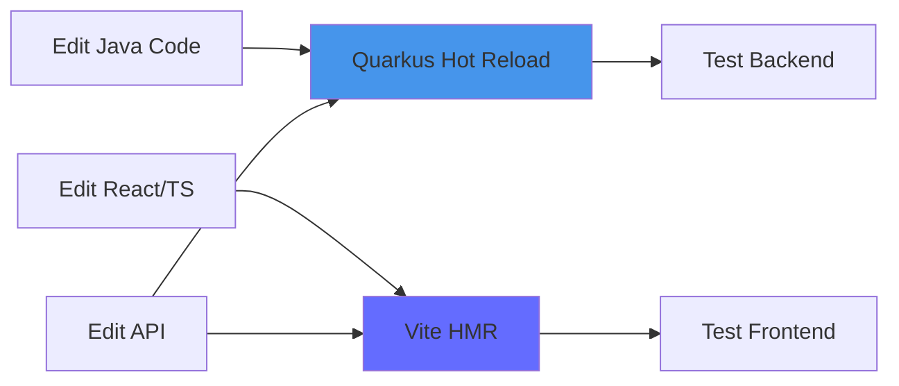
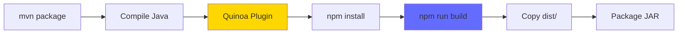
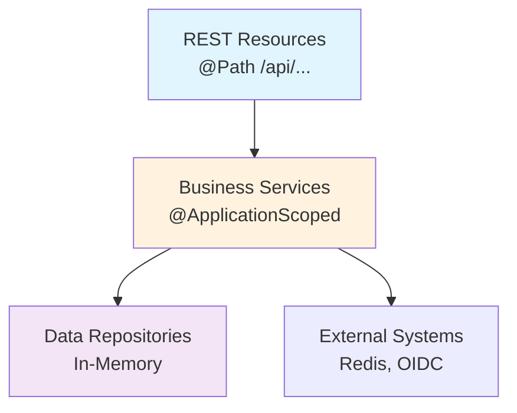
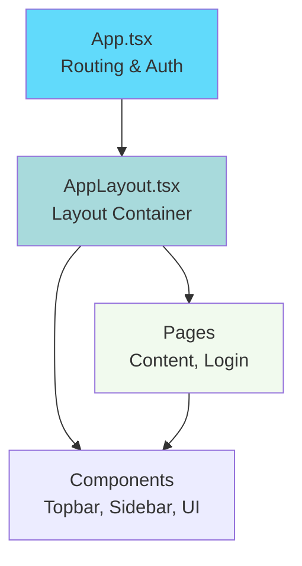

# Redis Manager

**A modern, full-stack web application for managing Redis instances** across different deployment topologies (Standalone, Sentinel, and Cluster). Built with Quarkus (Java backend) and React + Tailwind CSS (frontend), integrated seamlessly via Quarkus Quinoa.

## 📋 Table of Contents

- [Quick Start](#quick-start)
- [Overview](#overview)
- [Technology Stack](#technology-stack)
- [System Architecture](#system-architecture)
- [Features](#features)
- [Development](#development)
- [Production Build & Deployment](#production-build--deployment)
- [API Documentation](#api-documentation)
- [Configuration](#configuration)
- [Troubleshooting](#troubleshooting)
- [Project Structure](#project-structure)

---

## Quick Start

### Prerequisites
- Java 21 JDK
- Maven 3.9+
- Node.js 24+ (optional - Quinoa can auto-install)

### Run in Development Mode

```bash
# Clone and navigate to project
git clone <repository-url>
cd redis-manager

# Start dev mode (auto-starts both backend and frontend)
./mvnw quarkus:dev

# Access the application
# → Frontend: http://localhost:8080/
# → Dev UI: http://localhost:8080/q/dev-ui
# → API Docs: http://localhost:8080/q/swagger-ui
```

Changes to Java or TypeScript/React code will hot-reload automatically! 🔥

---

## Overview

Redis Manager provides a **modern web interface** for managing Redis connections, browsing databases, viewing keys, and inspecting values. It supports all major Redis deployment topologies and includes pluggable authentication.

### Key Features

✨ **Core Capabilities**
- 🔐 **Multi-provider Authentication**: Basic, OIDC, and Azure Entra ID support
- � **User Profile Modal**: View session info, username, and auth provider details
- �🔄 **Redis Topology Support**: Standalone, Sentinel, and Cluster modes
- 📊 **Database Browser**: Navigate databases, scan keys, view values with type detection
- 🔌 **Connection Management**: Create/edit Redis connections with modal dialogs
- 📋 **Key Value Inspector**: View and copy Redis values with type-aware formatting
- 🎨 **Modern UI**: Responsive React interface with Tailwind CSS and shadcn/ui components
- 🚀 **Hot Reload Development**: Integrated frontend/backend development workflow
- 📦 **Single Artifact**: Self-contained JAR with embedded frontend

🛠️ **Technical Features**
- RESTful API with OpenAPI documentation
- Reactive Redis client (Lettuce) with connection pooling
- Type-safe frontend with TypeScript
- Observable application with OpenTelemetry + Prometheus
- Configurable timeouts and connection management

---

## Technology Stack

### Backend

| Technology | Version | Purpose |
|-----------|---------|---------|
| **Java** | 21 (LTS) | Runtime platform |
| **Quarkus** | 3.28.3 | Application framework |
| **Lettuce** | 6.4.2 | Redis client library |
| **MapStruct** | 1.5.5 | Object mapping |
| **Jakarta REST** | - | RESTful API |
| **Quarkus OIDC** | - | OpenID Connect authentication |

### Frontend

| Technology | Version | Purpose |
|-----------|---------|---------|
| **React** | 19.1.1 | UI framework |
| **TypeScript** | 5.9.3 | Type safety |
| **Vite** | 7.1.7 | Build tool & dev server |
| **Tailwind CSS** | 4.1.14 | Utility-first CSS |
| **React Router** | 7.9.4 | Client-side routing |
| **shadcn/ui** | - | Component library |

### Integration

- **Quarkus Quinoa**: Bridges Java backend with Node.js frontend build
- **Maven**: Backend dependency management
- **npm**: Frontend package management

---

## System Architecture

### High-Level Architecture



### Development vs Production



### How Quarkus + Quinoa + Vite Work Together

**In Development Mode (`./mvnw quarkus:dev`)**:
- Quinoa installs Node/npm if needed
- Starts Vite dev server on port 5173
- Quarkus proxies frontend requests from :8080 to :5173
- You only need one command to run both backend and frontend
- Hot reload works for both Java and TypeScript/React

**In Production (`java -jar ...`)**:
- Quinoa runs `npm run build` during Maven build
- Vite generates optimized static assets in `dist/client`
- Assets are embedded in the Quarkus JAR
- Single self-contained application runs on port 8080

---

## Features

### Authentication System

The application supports **pluggable authentication** via the `AUTH_PROVIDER` environment variable:

```bash
# Basic authentication (default, in-memory)
export AUTH_PROVIDER=BASIC

# OpenID Connect
export AUTH_PROVIDER=OIDC

# Azure Entra ID (future)
export AUTH_PROVIDER=ENTRAID
```

**Authentication Flow:**



**Session Details:**
- Cookie name: `rm_session`
- TTL: 30 minutes (configurable)
- HttpOnly flag for XSS protection
- SameSite policy enabled

### User Profile & Session Management

The application includes a **user profile modal** that displays current session information and user details.

**Accessing the Profile:**
1. Click on the user avatar in the top-right corner of the navigation bar
2. Select "Profile" from the dropdown menu
3. View detailed session information in the modal dialog

**Profile Information Displayed:**

| Section | Information | Source |
|---------|-------------|--------|
| **User Identity** | Username and avatar | Session cookie + `/api/auth/me` |
| **Authentication** | Active auth provider (BASIC/OIDC/ENTRAID) | `/api/auth/provider` |
| **Session Status** | Active status and 30-minute timeout | Cookie TTL |

**Profile Modal Features:**
- 👤 Large user avatar with initials fallback
- 📊 Real-time session information
- 🔐 Authentication provider visibility
- ⏱️ Session timeout indicator
- 📱 Responsive design for all screen sizes
- ⌨️ Full keyboard navigation support

**Technical Implementation:**
```typescript
// Lazy-loaded data fetching
useEffect(() => {
  if (modalOpen) {
    Promise.all([
      fetch('/api/auth/me'),      // Get user info
      fetch('/api/auth/provider') // Get auth provider
    ]).then(([user, provider]) => {
      // Update modal state
    });
  }
}, [modalOpen]);
```

The profile modal only fetches data when opened, minimizing unnecessary API calls and improving performance.

**User Profile Flow:**



### Redis Topology Support

The application supports all three Redis deployment modes:



**Connection Configuration:**

```typescript
// Standalone
{
  "name": "Local Redis",
  "type": "NODE",
  "urls": [{"host": "localhost", "port": 6379}],
  "credentials": {"username": null, "password": "secret123"},
  "timeoutMs": 5000
}

// Sentinel
{
  "name": "HA Redis",
  "type": "SENTINEL",
  "urls": [
    {"host": "sentinel1", "port": 26379},
    {"host": "sentinel2", "port": 26379}
  ],
  "sentinelMasterId": "mymaster",
  "credentials": {"username": null, "password": "secret123"}
}

// Cluster
{
  "name": "Clustered Redis",
  "type": "CLUSTER",
  "urls": [
    {"host": "node1", "port": 7000},
    {"host": "node2", "port": 7001},
    {"host": "node3", "port": 7002}
  ]
}
```

### Database Browser

**Key Operations:**

| Operation | Command | Implementation |
|-----------|---------|----------------|
| List Databases | `CONFIG GET databases` | Query available DB indexes |
| Count Keys | `SELECT db; DBSIZE` | Get key count per database |
| Scan Keys | `SCAN cursor MATCH pattern` | Non-blocking key iteration |
| Get Key Type | `TYPE key` | Determine value type |
| Get Value | Type-specific GET | Retrieve based on type |
| Get TTL | `PTTL key` | Get expiration time |

**Supported Redis Types:**
- ✅ **String**: Simple key-value pairs
- ✅ **List**: Ordered collections
- ✅ **Set**: Unordered unique values
- ✅ **Sorted Set**: Ordered sets with scores
- ✅ **Hash**: Field-value maps

**Browse Flow:**

```mermaid
sequenceDiagram
    participant UI
    participant API
    participant Redis
    
    UI->>API: GET /instances/{id}/databases
    API->>Redis: CONFIG GET databases
    Redis-->>API: 16
    loop For each DB
        API->>Redis: SELECT {db}; DBSIZE
        Redis-->>API: key count
    end
    API-->>UI: {0: 1250, 1: 45, ...}
    
    UI->>API: GET /instances/{id}/keys?db=0
    API->>Redis: SCAN 0 MATCH * COUNT 1000
    Redis-->>API: keys + cursor
    API->>Redis: PIPELINE: TYPE key1, TYPE key2, ...
    Redis-->>API: [string, hash, ...]
    API-->>UI: [{key, type}, ...]
    
    UI->>API: GET /instances/{id}/keys/user:1?db=0
    API->>Redis: SELECT 0; TYPE user:1; HGETALL user:1
    Redis-->>API: value + metadata
    API-->>UI: RedisValue{type, value, ttl}
```

---

## Development

### Initial Setup

```bash
# Clone repository
git clone <repository-url>
cd redis-manager

# Start development mode
./mvnw quarkus:dev
```

### Useful Dev URLs

| URL | Purpose |
|-----|---------|
| http://localhost:8080/ | Application frontend (proxied to Vite) |
| http://localhost:8080/q/dev-ui | Quarkus development UI |
| http://localhost:8080/q/swagger-ui | Interactive API documentation |
| http://localhost:8080/api | REST API base path |

### Frontend-Only Development

For pure UI work without the backend:

```bash
cd src/main/webui
npm install
npm run dev

# Access at http://localhost:5173/
# Note: API calls will fail without backend running
```

### Development Workflow



**Hot Reload Features:**
- ✅ Java class changes reload automatically
- ✅ React components update with HMR (Hot Module Replacement)
- ✅ CSS changes apply instantly
- ✅ Configuration changes trigger reload
- ✅ No need to restart server during development

---

## Production Build & Deployment

### Building the Application

```bash
# Clean build
./mvnw clean package

# This will:
# 1. Compile Java sources
# 2. Run Quinoa plugin
# 3. Install npm dependencies
# 4. Build frontend (npm run build)
# 5. Copy dist/ to target/
# 6. Package JAR with embedded assets
```

**Build Process:**



### Running in Production

**Option 1: Using provided script (recommended)**

```bash
./run-app.sh
```

**Option 2: Manual execution**

```bash
java \
  --add-opens java.base/java.lang=ALL-UNNAMED \
  -Dio.netty.noUnsafe=true \
  -jar target/quarkus-app/quarkus-run.jar
```

**⚠️ Important:** The JVM arguments are **required** for Java 21+:
- `--add-opens java.base/java.lang=ALL-UNNAMED`: Allows JBoss Threads to access internal APIs
- `-Dio.netty.noUnsafe=true`: Disables deprecated Netty unsafe operations

### Docker Deployment

```dockerfile
FROM registry.access.redhat.com/ubi9/openjdk-21:latest

# Copy application
COPY target/quarkus-app /app

# Expose port
EXPOSE 8080

# Run with required JVM arguments
ENTRYPOINT ["java", \
  "--add-opens", "java.base/java.lang=ALL-UNNAMED", \
  "-Dio.netty.noUnsafe=true", \
  "-jar", "/app/quarkus-run.jar"]
```

Build and run:

```bash
# Build Docker image
docker build -t redis-manager:latest .

# Run container
docker run -d \
  -p 8080:8080 \
  -e AUTH_PROVIDER=BASIC \
  --name redis-manager \
  redis-manager:latest
```

### Alternative Packaging

**Uber JAR (single fat JAR):**

```bash
./mvnw package -Dquarkus.package.jar.type=uber-jar

java \
  --add-opens java.base/java.lang=ALL-UNNAMED \
  -Dio.netty.noUnsafe=true \
  -jar target/*-runner.jar
```

**Native Image (GraalVM):**

```bash
./mvnw package -Dnative

# No JVM args needed for native
./target/redis-mgr-1.0.0-runner
```

---

## API Documentation

### Authentication Endpoints

| Method | Path | Description | Request | Response |
|--------|------|-------------|---------|----------|
| `GET` | `/api/auth/provider` | Get active auth provider | - | `{provider: "BASIC"}` |
| `POST` | `/api/auth/login` | Authenticate user | `{username, password}` | Set-Cookie + `{username}` |
| `GET` | `/api/auth/me` | Get current session | Cookie | `{username}` |
| `POST` | `/api/auth/logout` | End session | Cookie | Clear-Cookie |

### Redis Connection Endpoints

| Method | Path | Description | Request | Response |
|--------|------|-------------|---------|----------|
| `GET` | `/api/redis/connections` | List all connections | - | `[{id, name, type, ...}]` |
| `GET` | `/api/redis/connections/{id}` | Get connection details | - | `{id, name, type, ...}` |
| `POST` | `/api/redis/connections` | Create connection | `CreateConnectionRequest` | `{id, name, ...}` |
| `PUT` | `/api/redis/connections/{id}` | Update connection | `CreateConnectionRequest` | `{id, name, ...}` |
| `DELETE` | `/api/redis/connections/{id}` | Delete connection | - | `204 No Content` |

### Redis Instance Endpoints

| Method | Path | Description | Query Params | Response |
|--------|------|-------------|--------------|----------|
| `GET` | `/api/redis/instances/{id}/databases` | List databases | - | `{0: 1250, 1: 45, ...}` |
| `GET` | `/api/redis/instances/{id}/keys` | List keys in DB | `db`, `pattern`, `count` | `[{key, type}, ...]` |
| `GET` | `/api/redis/instances/{id}/keys/{key}` | Get key value | `db` | `RedisValue` object |

### Example API Calls

```bash
# Login
curl -X POST http://localhost:8080/api/auth/login \
  -H "Content-Type: application/json" \
  -d '{"username":"admin","password":"admin"}' \
  -c cookies.txt

# List connections
curl -X GET http://localhost:8080/api/redis/connections \
  -b cookies.txt

# Create connection
curl -X POST http://localhost:8080/api/redis/connections \
  -H "Content-Type: application/json" \
  -b cookies.txt \
  -d '{
    "name": "Local Redis",
    "type": "NODE",
    "urls": [{"host": "localhost", "port": 6379}],
    "credentials": {"username": null, "password": null},
    "timeoutMs": 5000
  }'

# Get databases
curl -X GET http://localhost:8080/api/redis/instances/1/databases \
  -b cookies.txt

# List keys
curl -X GET "http://localhost:8080/api/redis/instances/1/keys?db=0&pattern=*&count=100" \
  -b cookies.txt

# Get key value
curl -X GET "http://localhost:8080/api/redis/instances/1/keys/user:1001?db=0" \
  -b cookies.txt
```

**Interactive Documentation:**
Visit http://localhost:8080/q/swagger-ui when running the application to explore and test all endpoints.

---

## Configuration

### Application Properties

Key configuration in `src/main/resources/application.properties`:

```properties
# Server Configuration
quarkus.http.port=8080

# Frontend Integration (Quinoa)
quarkus.quinoa.ui-dir=src/main/webui
quarkus.quinoa.build-dir=dist/client
quarkus.quinoa.dev-server.port=5173
quarkus.quinoa.package-manager=npm

# Quinoa Auto-Install Node/NPM
quarkus.quinoa.package-manager-install=true
quarkus.quinoa.package-manager-install.node-version=24.10.0
quarkus.quinoa.package-manager-install.npm-version=11.6.0

# JVM Arguments (for Java 21+)
quarkus.jvm.args=--add-opens java.base/java.lang=ALL-UNNAMED -Dio.netty.noUnsafe=true
quarkus.dev.jvm-args=--add-opens java.base/java.lang=ALL-UNNAMED -Dio.netty.noUnsafe=true

# Application Identity
quarkus.application.name=redis-manager

# Observability (OpenTelemetry + Prometheus)
quarkus.otel.exporter.otlp.endpoint=http://localhost:4317
```

### Environment Variables

| Variable | Values | Default | Purpose |
|----------|--------|---------|---------|
| `AUTH_PROVIDER` | `BASIC`, `OIDC`, `ENTRAID` | `BASIC` | Authentication provider |
| `QUARKUS_HTTP_PORT` | Port number | `8080` | Server port |
| `QUARKUS_OIDC_AUTH_SERVER_URL` | URL | - | OIDC provider URL (if using OIDC) |
| `QUARKUS_OIDC_CLIENT_ID` | String | - | OIDC client ID |
| `QUARKUS_OIDC_CREDENTIALS_SECRET` | String | - | OIDC client secret |

### OIDC Configuration Example

```properties
# OpenID Connect Configuration
quarkus.oidc.auth-server-url=https://your-oidc-provider.com/realms/myrealm
quarkus.oidc.client-id=redis-manager
quarkus.oidc.credentials.secret=your-client-secret
quarkus.oidc.application-type=web-app
```

---

## Troubleshooting

### Common Issues & Solutions

#### ❌ Java Module Access Error

**Error:**
```
IllegalAccessError: class io.quarkus.bootstrap.runner.RunnerClassLoader
cannot access class java.lang.Thread
```

**Solution:**
Add JVM argument: `--add-opens java.base/java.lang=ALL-UNNAMED`

This is required for JBoss Threads to access internal Java APIs in Java 17+.

---

#### ⚠️ Netty Unsafe Deprecation Warning

**Warning:**
```
WARNING: sun.misc.Unsafe is deprecated and will be removed in a future release
```

**Solution:**
Add JVM argument: `-Dio.netty.noUnsafe=true`

This disables Netty's use of deprecated unsafe operations.

---

#### 🔌 Redis Connection Timeout

**Error:**
```
Command timed out after 5000 milliseconds
```

**Solutions:**
1. Verify Redis is accessible: `redis-cli -h <host> -p <port> ping`
2. Check firewall rules allow port 6379 (or custom port)
3. Increase timeout in connection configuration
4. For Sentinel/Cluster, ensure all nodes are reachable
5. Check network latency with `ping <redis-host>`

---

#### 🌐 Frontend Not Loading

**Issue:** Blank page or 404 errors in dev mode

**Solutions:**
1. Check Quinoa configuration in `pom.xml`:
   ```xml
   <dependency>
       <groupId>io.quarkiverse.quinoa</groupId>
       <artifactId>quarkus-quinoa</artifactId>
   </dependency>
   ```

2. Verify `src/main/webui` exists with `package.json`

3. Check Quarkus console for Vite startup logs:
   ```
   Quinoa detected Vite... starting dev server
   VITE v7.1.7 ready in 234 ms
   ```

4. Manually install dependencies:
   ```bash
   cd src/main/webui
   npm install
   ```

5. Check Vite is running on port 5173:
   ```bash
   lsof -i :5173
   ```

---

#### 🔐 Authentication Fails

**Issue:** Login returns 401 or 500 error

**Solutions:**
1. Check `AUTH_PROVIDER` environment variable:
   ```bash
   echo $AUTH_PROVIDER  # Should be BASIC, OIDC, or ENTRAID
   ```

2. For Basic auth, verify default credentials:
   - Username: `admin`
   - Password: `admin` (or check `BasicAuthProvider`)

3. For OIDC, verify configuration:
   ```bash
   # Check OIDC server is reachable
   curl https://your-oidc-provider.com/.well-known/openid-configuration
   ```

4. Check application logs for auth errors:
   ```bash
   ./mvnw quarkus:dev | grep -i auth
   ```

---

#### 📦 Build Fails

**Error:** `npm ERR!` or frontend build fails

**Solutions:**
1. Clear npm cache:
   ```bash
   cd src/main/webui
   rm -rf node_modules package-lock.json
   npm install
   ```

2. Check Node.js version:
   ```bash
   node --version  # Should be 24+
   npm --version   # Should be 11+
   ```

3. Build frontend manually to see full errors:
   ```bash
   cd src/main/webui
   npm run build
   ```

4. Disable Quinoa temporarily to isolate issue:
   ```properties
   quarkus.quinoa.enabled=false
   ```

---

### Debug Mode

Enable detailed logging:

```properties
# application.properties
quarkus.log.level=DEBUG
quarkus.log.category."dk.logos_code.redis_manager".level=DEBUG
quarkus.log.category."io.quarkus.quinoa".level=DEBUG
```

Or via environment variable:

```bash
export QUARKUS_LOG_LEVEL=DEBUG
./mvnw quarkus:dev
```

---

## Project Structure

```
redis-manager/
├── src/
│   ├── main/
│   │   ├── java/dk/logos_code/redis_manager/
│   │   │   ├── auth/                    # Authentication layer
│   │   │   │   ├── AuthProvider.java   # Auth interface
│   │   │   │   ├── BasicAuthProvider.java
│   │   │   │   ├── OidcAuthProvider.java
│   │   │   │   └── AuthResource.java   # REST endpoints
│   │   │   ├── config/
│   │   │   │   └── NettyConfigurer.java # Netty setup
│   │   │   └── redis/
│   │   │       ├── RedisService.java    # Core business logic
│   │   │       ├── RedisConnector.java  # Lettuce wrapper
│   │   │       ├── RedisConnectionRepository.java
│   │   │       ├── commands/            # Redis operations
│   │   │       │   ├── RedisDbCounts.java
│   │   │       │   ├── RedisListKeys.java
│   │   │       │   └── RedisGetValue.java
│   │   │       ├── datamodels/          # DTOs
│   │   │       │   ├── ConnectionConfig.java
│   │   │       │   ├── RedisValue.java
│   │   │       │   └── ...
│   │   │       ├── mappers/             # MapStruct
│   │   │       │   ├── ConnectionRequestMapper.java
│   │   │       │   └── ConnectionResponseMapper.java
│   │   │       └── resources/           # REST controllers
│   │   │           ├── RedisConnectionResource.java
│   │   │           └── RedisInstanceResource.java
│   │   ├── resources/
│   │   │   └── application.properties   # Configuration
│   │   └── webui/                       # Frontend (React + Vite)
│   │       ├── src/
│   │       │   ├── components/
│   │       │   │   ├── AppLayout.tsx    # Main layout
│   │       │   │   ├── DesktopTopbar.tsx # Topbar with breadcrumbs, user menu & profile modal
│   │       │   │   ├── DesktopSidebar.tsx
│   │       │   │   ├── modals/          # Modal dialogs
│   │       │   │   │   ├── ConnectionEditModal.tsx  # Create/edit Redis connections
│   │       │   │   │   ├── KeyValueViewerModal.tsx  # View Redis key values
│   │       │   │   │   └── index.ts     # Barrel exports
│   │       │   │   └── ui/              # shadcn components (Avatar, Button, Dialog, etc.)
│   │       │   ├── pages/
│   │       │   │   ├── Content.tsx      # Main Redis management page
│   │       │   │   └── Login.tsx
│   │       │   ├── routes/
│   │       │   │   └── LoginRoutes.tsx
│   │       │   ├── App.tsx              # Root component
│   │       │   └── index.css            # Tailwind imports
│   │       ├── package.json
│   │       ├── vite.config.ts
│   │       └── tsconfig.json
│   └── test/                            # Tests
├── pom.xml                              # Maven build
├── README.md                            # This file
├── ARCHITECTURE.md                      # Detailed architecture docs
└── JVM-ARGUMENTS.md                     # JVM argument details
```

### Component Responsibilities

**Backend Layers:**


**Frontend Layers:**


**Modal Components:**

The application uses **shadcn/ui Dialog** components for all modal interactions, ensuring consistent UX and accessibility:

| Modal | Purpose | Key Features |
|-------|---------|--------------|
| `ConnectionEditModal` | Create/edit Redis connections | • Dynamic form fields based on connection type (Standalone/Sentinel/Cluster)<br/>• Validates required fields<br/>• Supports authentication credentials<br/>• Configurable timeouts and database selection |
| `KeyValueViewerModal` | View Redis key values | • Supports all Redis data types (STRING, LIST, SET, HASH, ZSET)<br/>• Copy-to-clipboard functionality<br/>• Formatted JSON display for complex types<br/>• Loading and error states |

**Modal Implementation Pattern:**
```typescript
// All modals use shadcn Dialog with controlled state
<ConnectionEditModal
  open={!!editing}
  onOpenChange={(open) => {
    if (!open) handleClose()
  }}
  connection={editing}
  onConnectionChange={setEditing}
  onSave={handleSave}
  onCancel={handleCancel}
/>
```

**Benefits:**
- ✅ **Reusable**: Modal components can be used anywhere in the app
- ✅ **Accessible**: Built-in keyboard navigation (Esc to close) and ARIA labels
- ✅ **Consistent**: All modals share the same look and behavior
- ✅ **Type-safe**: Full TypeScript support with exported types
- ✅ **Maintainable**: Changes to modal logic only needed in one place

---

## Performance & Security

### Performance Considerations

**Connection Management:**
- Lettuce uses internal connection pooling
- Connections are closed after each operation (future: pool reuse)
- Configurable timeouts prevent hanging requests

**Key Scanning:**
- Uses `SCAN` instead of `KEYS` to avoid blocking Redis
- Configurable `COUNT` parameter (default: 1000 keys per iteration)
- Pattern matching done on Redis side (reduces network transfer)
- Pipelined `TYPE` commands for batch metadata retrieval

**Frontend Optimization:**
- Code splitting via Vite
- Tree shaking removes unused code
- Minified production bundles
- Lazy loading of routes (future enhancement)
- Debounced search inputs (future enhancement)

### Security Best Practices

**Production Deployment:**
1. ✅ **Use HTTPS**: Deploy behind reverse proxy (Nginx, Traefik, Caddy)
2. ✅ **Secure Cookies**: Enable `Secure` and `SameSite` flags
3. ✅ **CORS**: Configure allowed origins in production
4. ✅ **Rate Limiting**: Implement at proxy level
5. ✅ **Secrets Management**: Use Vault, AWS Secrets Manager, or Azure Key Vault
6. ✅ **Network Segmentation**: Isolate Redis from public network

**Redis Security:**
1. ✅ **Enable AUTH**: Set `requirepass` in redis.conf
2. ✅ **Bind Localhost**: Use `bind 127.0.0.1` unless remote access needed
3. ✅ **Disable Dangerous Commands**: Rename `CONFIG`, `FLUSHALL`, `SHUTDOWN`
4. ✅ **Use TLS**: For production Redis connections
5. ✅ **Regular Updates**: Keep Redis patched
6. ✅ **ACL Rules**: Use Redis 6+ ACLs for fine-grained permissions

**Example Reverse Proxy (Nginx):**

```nginx
server {
    listen 443 ssl http2;
    server_name redis-manager.example.com;

    ssl_certificate /etc/ssl/certs/redis-manager.crt;
    ssl_certificate_key /etc/ssl/private/redis-manager.key;

    location / {
        proxy_pass http://localhost:8080;
        proxy_set_header Host $host;
        proxy_set_header X-Real-IP $remote_addr;
        proxy_set_header X-Forwarded-For $proxy_add_x_forwarded_for;
        proxy_set_header X-Forwarded-Proto $scheme;
    }
}
```

---

## Future Enhancements

### Planned Features

- [ ] **Data Modification**: Edit and delete keys and values
- [ ] **CLI Mode**: Terminal interface for Redis commands
- [ ] **Real-time Monitoring**: Live metrics, slow queries, memory usage
- [ ] **Backup/Restore**: Export and import Redis data
- [ ] **Multi-user Support**: User management and RBAC
- [ ] **Key Favorites**: Bookmark frequently accessed keys
- [ ] **Query History**: Track and replay recent commands
- [ ] **Dark Mode**: Theme switcher with system preference detection
- [ ] **Mobile Support**: Improved responsive design for phones/tablets
- [ ] **Redis Modules**: Support for RedisJSON, RediSearch, RedisGraph
- [ ] **Pub/Sub Monitor**: Real-time message monitoring
- [ ] **Transaction Builder**: GUI for MULTI/EXEC commands
- [ ] **Performance Profiler**: Connection latency tracking

### Contributing

Contributions are welcome! Please:
1. Fork the repository
2. Create a feature branch (`git checkout -b feature/amazing-feature`)
3. Commit your changes (`git commit -m 'Add amazing feature'`)
4. Push to the branch (`git push origin feature/amazing-feature`)
5. Open a Pull Request

---

## References & Resources

### Documentation
- **Quarkus**: https://quarkus.io/guides/
- **Quarkus Quinoa**: https://quarkiverse.github.io/quarkiverse-docs/quarkus-quinoa/dev/
- **Lettuce**: https://lettuce.io/core/release/reference/
- **Vite**: https://vitejs.dev/guide/
- **React**: https://react.dev/learn
- **Tailwind CSS v4**: https://tailwindcss.com/docs
- **shadcn/ui**: https://ui.shadcn.com/

### Related Projects
- **Redis**: https://redis.io/documentation
- **Redis Sentinel**: https://redis.io/docs/management/sentinel/
- **Redis Cluster**: https://redis.io/docs/management/scaling/

### Tools
- **Redis CLI**: https://redis.io/docs/manual/cli/
- **Redis Insight**: https://redis.io/insight/ (official GUI)
- **RedisCommander**: https://github.com/joeferner/redis-commander

---

## License

[Include your license information here]

---

## Support & Contact

- **Issues**: https://github.com/jeesondk/redis-manager/issues
- **Discussions**: https://github.com/jeesondk/redis-manager/discussions
- **Email**: [your-email@example.com]

---

**Built with ❤️ using Quarkus, React, and lots of Redis queries**
